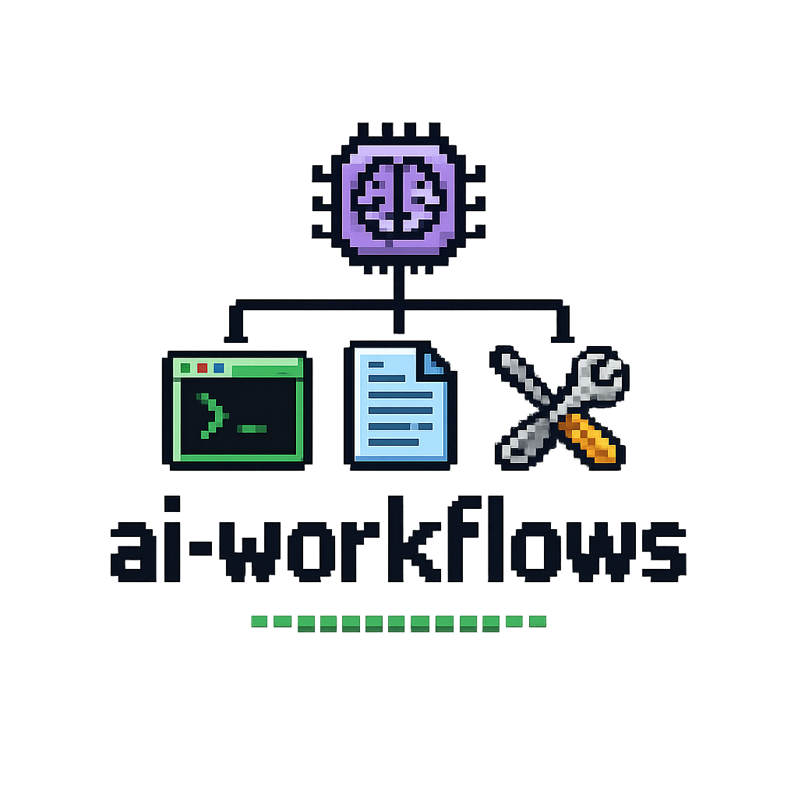

  

# ai-workflows

A reference playbook and skill library for Claude Code development workflows.

## Contents

- **[Workflow Playbook](index.html)** — interactive guide covering setup, common scenarios, and best practices
- **[Skills](skills/)** — catalog of Claude Code skills with documentation and definitions

## Skills

Each skill lives in `skills/{name}/` with a `README.md` (human docs) and `SKILL.md` (Claude-facing definition).

| Skill | Description |
|-------|-------------|
| [agent-prompt](skills/agent-prompt/) | Reference guide for writing effective agent prompts |
| [architecture-review](skills/architecture-review/) | Staff-level codebase health review |
| [conflicts](skills/conflicts/) | Intelligent merge conflict resolution |
| [dependabot-review](skills/dependabot-review/) | Analyze vulnerability alerts and trace code paths |
| [extract-design-tokens](skills/extract-design-tokens/) | Extract design tokens from existing UI |
| [find-warden-bugs](skills/find-warden-bugs/) | Bug detection from historical patterns |
| [gh-review](skills/gh-review/) | Submit GitHub PR reviews via CLI |
| [grafana-logs](skills/grafana-logs/) | Query Grafana/Loki logs for production services |
| [judge-plan](skills/judge-plan/) | Independent plan/spec reviewer |
| [linear-create](skills/linear-create/) | Create Linear tickets from current context |
| [plan-ceo-review](skills/plan-ceo-review/) | CEO/founder-mode plan review |
| [plan-eng-review](skills/plan-eng-review/) | Engineering manager plan review |
| [pr-review](skills/pr-review/) | 25-point PR review checklist |
| [prompter-system](skills/prompter-system/) | System prompt and agent prompt management |
| [qa](skills/qa/) | Systematic QA testing with health scores |
| [retro](skills/retro/) | Weekly retrospective with git history analysis |
| [review](skills/review/) | Pre-landing diff analysis |
| [setup-browser-cookies](skills/setup-browser-cookies/) | Import browser cookies into headless sessions |
| [ship](skills/ship/) | Full shipping workflow: merge, test, changelog, PR |
| [testing-guidelines](skills/testing-guidelines/) | Guide for writing integration tests |
| [warden](skills/warden/) | Code quality analyzer before committing |
| [warden-sweep](skills/warden-sweep/) | Full-repository code sweep |
| [browse](skills/browse/) | *(external)* Headless browser — part of gstack |
| [frontend-slides](skills/frontend-slides/) | *(external)* Animation-rich HTML presentations |
| [gstack](skills/gstack/) | *(external)* Full Claude Code workflow plugin |
| [infra-docs-skill](skills/infra-docs-skill/) | *(internal)* Fuse Finance infra docs |
